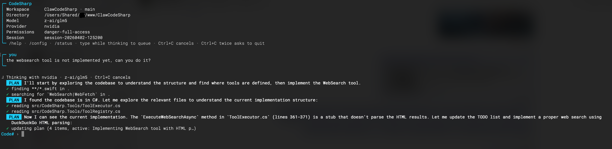
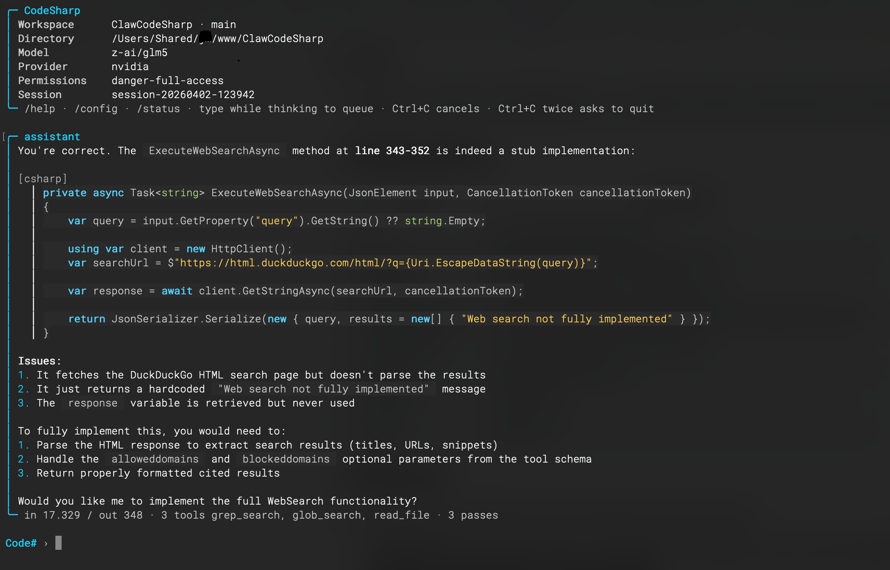

# CodeSharp

CodeSharp is a terminal-first coding assistant for .NET developers who want fast answers, clean repo navigation, and a CLI that feels built for real work instead of demos.

Built as a modern C#/.NET 10 take on the original Claw Code, it brings Anthropic, NVIDIA, OpenAI, and xAI models into a sharper REPL with live streaming, readable markdown rendering, colored diff previews, clearer tool feedback, and smoother code-reading and editing workflows.

It also adds practical features that matter in daily use: slash-command suggestions, guided config management, pinned full-screen REPL layout, parallel read-only repo analysis, smarter search output with context, and better handling for queued prompts, retries, and interrupt flow.

## Showcase

<p>
  
  
</p>

## Features

### Agent & Planning
- **Planning mode** — the model can call `EnterPlanMode` and `ExitPlanMode` itself, or you can use `/plan` and `/plan approve`. In planning mode all mutating tools are blocked; the assistant produces a structured plan with Goal, Assumptions, Steps, Risks, and Validation sections.
- **Agent tool with subagent types** — `Agent` now spawns an isolated `ConversationRuntime` per call. `subagent_type: "Explore"` maps to a read-only analysis agent, `"Plan"` runs in planning mode, and the default runs a focused task agent. Each has its own session and type-specific system prompt.
- **Automatic verification** — after file edits the runtime detects the build system (dotnet, pnpm/npm typecheck, python -m py_compile) and runs it automatically, feeding the result back to the model as a system note.

### Git Workflow
- `/commit` — AI-generates a conventional commit message from staged changes, shows a preview, and commits on confirmation.
- `/diff` — shows `git diff --stat` plus a colored inline diff with green additions and red removals, truncated at 200 lines.
- `/branch` — list branches, create and switch with `/branch <name>`, or checkout an existing one with `/branch checkout <name>`.
- `/worktree` — list, add, and remove git worktrees directly from the REPL.
- `/pr` — generates a PR title and body with the model, previews them, and calls `gh pr create` on confirmation.

### Memory & Context
- **Auto-loaded memory** — `CODESHARP.md`, `.codesharp/MEMORY.md`, and all `.codesharp/memory/*.md` files are included in the system prompt automatically at session start.
- `/memory` — lists memory files; `/memory <name>` shows the content of a specific file. Edit files in `.codesharp/memory/` to persist facts across sessions.
- **Session compaction** — `/compact` summarizes old messages via the model and rebuilds the session history to stay within context limits while preserving recent turns.

### Search & Navigation
- **Parallel read-only analysis** — `read_file`, `glob_search`, `grep_search`, `find_symbol`, `find_references`, and task tools run in parallel within a single assistant step.
- **Symbol and reference search** — `find_symbol` and `find_references` cover C#, TypeScript, Python, C/C++, and HTML across the whole workspace without a language server.
- `/symbols <name>` and `/refs <name>` — symbol and reference search directly from the REPL with formatted output.
- **Gitignore-aware search** — `glob_search` and `grep_search` respect `.gitignore` and skip `bin`, `obj`, `.git`, `node_modules`, and similar noise folders.

### REPL Experience
- **Live streaming** — assistant text streams into the UI while the model is still thinking, reducing dead time between tool calls.
- **Slash command suggestions** — typing `/` shows live-narrowing command completions.
- **Colored diff previews** — file edits show a green/red inline diff inline in the activity log.
- **Queued prompts** — type while the model is thinking; the next prompt is queued and sent automatically when the current turn finishes.
- **Interrupt flow** — `Ctrl+C` cancels the active turn first; a second interrupt exits.
- **Session export** — `/export [path]` saves the full session transcript as a markdown file.

### System Prompt (aligned with Claude Code)
The system prompt now follows the same structure as Claude Code's leaked guidelines:
- **Doing tasks** — no scope creep, no added comments on untouched code, no speculative abstractions, no error handling for impossible cases.
- **Output style** — lead with the answer, not the reasoning; no filler; file references use `path:line` format.
- **Git workflow** — conventional commits, no force-push to main, PR format.
- **Planning mode** — when to use `EnterPlanMode`, what to produce, when to exit.
- **Security** — no command injection, XSS, SQL injection, or path traversal; validate only at system boundaries.


## Project Structure

```
CodeSharp.sln
src/
├── CodeSharp.Core/                  # Core runtime, session, permissions
├── CodeSharp.Api/                   # HTTP client, API providers
├── CodeSharp.Tools/                 # Tool registry and execution
├── CodeSharp.Plugins/               # Plugin management
├── CodeSharp.Lsp/                   # LSP integration
├── CodeSharp.Commands/              # Slash commands
├── CodeSharp.Cli/                   # Main CLI application
└── CodeSharp.Server/                # HTTP server for sessions
```

## Build

Requirements:
- .NET 10 SDK

`global.json` currently pins SDK `10.0.100`.

```bash
dotnet restore CodeSharp.sln
dotnet build CodeSharp.sln
```

## Run

### Interactive REPL Mode

```bash
dotnet run --project src/CodeSharp.Cli
```

### Single Prompt Mode

```bash
dotnet run --project src/CodeSharp.Cli -- "Explain this codebase"
```

### With Specific Provider

```bash
dotnet run --project src/CodeSharp.Cli -- --provider nvidia -p "What does this function do?"
```

### Default Model

The default model is currently `moonshotai/kimi-k2.5`, routed through the NVIDIA provider unless you override it.

## Standalone Binary

You can build a standalone single-file binary with `dotnet publish`.

### macOS (Apple Silicon)

```bash
dotnet publish src/CodeSharp.Cli/CodeSharp.Cli.csproj \
  -c Release \
  -r osx-arm64 \
  --self-contained true \
  /p:PublishSingleFile=true
```

### macOS (Intel)

```bash
dotnet publish src/CodeSharp.Cli/CodeSharp.Cli.csproj \
  -c Release \
  -r osx-x64 \
  --self-contained true \
  /p:PublishSingleFile=true
```

### Linux x64

```bash
dotnet publish src/CodeSharp.Cli/CodeSharp.Cli.csproj \
  -c Release \
  -r linux-x64 \
  --self-contained true \
  /p:PublishSingleFile=true
```

### Windows x64

```bash
dotnet publish src/CodeSharp.Cli/CodeSharp.Cli.csproj \
  -c Release \
  -r win-x64 \
  --self-contained true \
  /p:PublishSingleFile=true
```

The published binary ends up under:

```text
src/CodeSharp.Cli/bin/Release/net10.0/<RID>/publish/
```

If you prefer a framework-dependent build instead of bundling the runtime, replace `--self-contained true` with `--self-contained false`.

## Config Files

CodeSharp now uses a few distinct config and state files. They serve different purposes:

- `~/.codesharp/settings.json`
  Global defaults for the CLI. This is where `codesharp config` stores your preferred provider, model, and provider-specific API keys.
- `./.codesharp/settings.json`
  Project-local config created by `codesharp init`. Repo-local settings including plugin config.
- `./CODESHARP.md`
  Project instructions for the agent. Included in the system prompt at session start. Define coding conventions, repo context, or workflow notes here.
- `./.codesharp/MEMORY.md`
  Memory index. Each line should be a pointer to a memory file. Included in the system prompt automatically.
- `./.codesharp/memory/*.md`
  Individual memory files (user, feedback, project, reference types). All `.md` files in this folder are loaded into the system prompt at session start. Use `/memory` in the REPL to browse them.
- `./.codesharp/sessions/session-*.json`
  Saved conversation/session files for prompt and REPL runs.
- `./.codesharp-todos.json`
  Todo state written by the internal plan/todo tool.

CLI flags still win over stored defaults. For example, `--model` and `--provider` override values from `~/.codesharp/settings.json` for that run.

### Global Config Example

```json
{
  "Model": "moonshotai/kimi-k2.5",
  "Provider": "nvidia",
  "ApiKeys": {
    "Nvidia": "nvapi-..."
  }
}
```

### Project Bootstrap

Run this once inside a repo to create the local project files:

```bash
codesharp init
```

That creates:

- `.codesharp/settings.json`
- `CODESHARP.md`

### Managing Global Defaults

Interactive menu:

```bash
codesharp config
```

Non-interactive examples:

```bash
codesharp config show
codesharp config set provider nvidia
codesharp config set model moonshotai/kimi-k2.5
codesharp config set api-key nvidia
codesharp config unset model
```

## Available Options

| Flag | Description |
|------|-------------|
| `-p` | Run a single prompt and exit |
| `--model` | Model to use (default: `moonshotai/kimi-k2.5`) |
| `--provider` | API provider: anthropic, nvidia, openai, xai |
| `--permission-mode` | Permission mode: read-only, workspace-write, danger-full-access |
| `--allowedTools` | Comma-separated list of allowed tools |
| `--output` | Output format: text, json |
| `--version` | Show version |
| `--help` | Show help |

## Slash Commands

| Command | Description |
|---------|-------------|
| `/help` | Show all commands |
| `/status` | Model, mode, permissions, token usage, git branch |
| `/model [name]` | Show or switch the active model mid-session |
| `/permissions [mode]` | Show or switch permission mode |
| `/plan` | Enter planning mode (blocks all mutating tools) |
| `/plan deep` | Enter deep planning mode |
| `/plan approve` | Approve plan and return to execute mode |
| `/plan exit` | Exit planning mode without approving |
| `/compact` | Summarize old messages to reduce context size |
| `/diff` | Show git status and colored diff |
| `/commit` | AI-generate a commit message and commit |
| `/branch [name]` | List branches or create and switch to a new one |
| `/branch checkout <name>` | Switch to an existing branch |
| `/worktree` | List git worktrees |
| `/worktree add <path> [branch]` | Create a new worktree |
| `/worktree remove <path>` | Remove a worktree |
| `/pr` | Generate a PR title/body and open via `gh pr create` |
| `/symbols <name>` | Find symbol declarations across the workspace |
| `/refs <name>` | Find symbol references across the workspace |
| `/memory` | List memory files in `.codesharp/memory/` |
| `/memory <name>` | Show the content of a specific memory file |
| `/cost` | Show token usage and estimated cost breakdown |
| `/export [path]` | Save session transcript as markdown |
| `/clear --confirm` | Clear session history |
| `/config` | Interactive config menu |
| `/version` | Show version |
